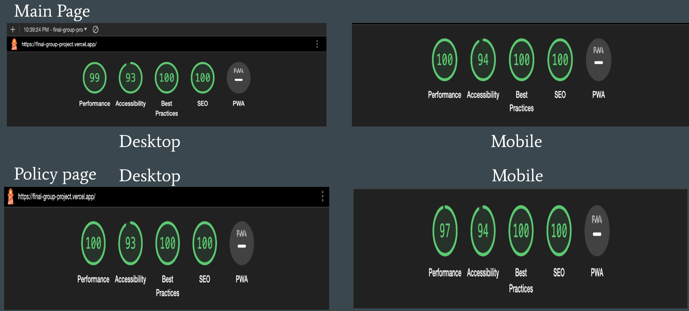

Docuementation of Website Testing

This document outlines the implementation of a Next.js project with integrated testing using Playwright and Lighthouse, as well as the process for acceptance testing.

Next.js Implementation:

Setup
Project Initialization: Created a new Next.js project using create-next-app.
Routing and Pages: Set up pages and routing in the pages directory.

Features
- Utilized Next.js's Server-Side Rendering (SSR) and Static Site Generation (SSG) capabilities.
- Implemented API routes in the pages/api directory for backend functionality.
- Used nextui to create subsribtion submit buttom for mailchimp.

Playwright Testing:
Automated testing is crucial for maintaining the website's functionality and performance. The  tests are conducted for different components of our website.

Configuration
Installed Playwright with npm install @playwright/test.
Configured Playwright to run tests in different browsers.

PLaywright Example: Testing Navigation page and ensures buttons work correctly

const { test, expect } = require('@playwright/test');

test('navbar should be present and links should work', async ({ page }) => {
  // Navigate to the page that contains the CookieConsent component
  await page.goto('http://localhost:3000/');

  // Check if the navbar is in the DOM
  const navbar = page.locator('nav'); // Replace 'nav' with the actual selector for your navbar
  await expect(navbar).toBeVisible();

Lighthouse Testing:

Integration: Integrated Lighthouse for performance and accessibility testing.

!

    Test Execution: Ran Lighthouse tests on both desktop and mobile configurations.
    Optimization: Used Lighthouse reports to optimize website performance.

Acceptance Testing:
Criteria Definition: Outlined acceptance criteria for each feature.
User Testing: Conducted user testing sessions to validate the functionality.
Feedback Incorporation: Incorporated user feedback into the development process.

Conclusion
This project demonstrates a comprehensive approach to web development using Next.js, with robust testing strategies employing Playwright and Lighthouse, and thorough acceptance testing to ensure quality and performance.

